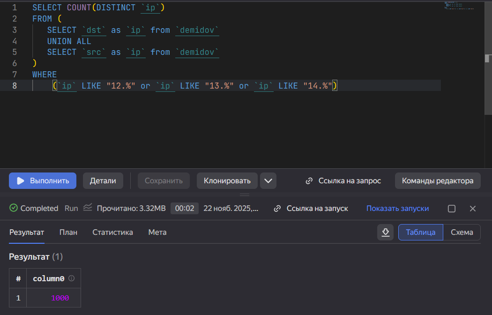
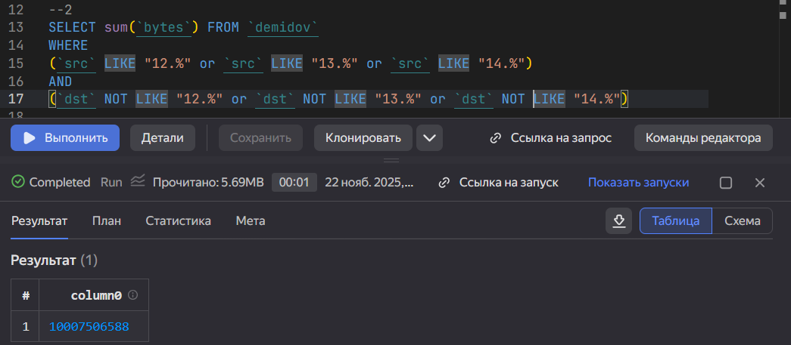
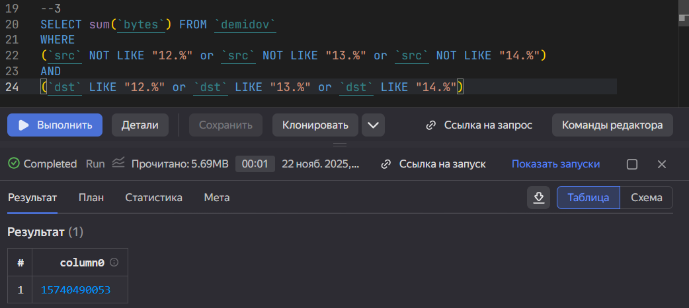

# Использование технологии Yandex Query для анализа данных сетевой
активности

## Цель работы

1 Изучить возможности технологии Yandex Query для анализа
структурированных наборов данных; 2 Получить навыки построения
аналитического пайплайна для анализа данных c помощью сервисов Yandex
Cloud; 3 Закрепить практические навыки использования SQL для анализа
данных сетевой активности в сегментированной корпоративной сети.

### Ход выполнения

1 Известно, что IP адреса внутренней сети начинаются с октетов,
принадлежащих интервалу \[12-14\]. Определите количество хостов
внутренней сети, представленных в датасете.

`1000`

2 Определите суммарный объем исходящего трафика.

`10007506588 (10.01 ГБ)`

3 Определите суммарный объем входящего трафика

`15740490053 (15.74 ГБ)`

## Оценка результата

В результате лабораторной работы мы проанализировали трафик, используя
Yandex Query.

## Вывод

Таким образом, мы: - Изучили возможности технологии Yandex Query для
анализа структурированных наборов данных; - Получили навыки построения
аналитического пайплайна для анализа данных c помощью сервисов Yandex
Cloud; - Закрепили практические навыки использования SQL для анализа
данных сетевой активности в сегментированной корпоративной сети.
